Здесь хранятся файлы проекта «Предсказание изменения ландшафта Земли по спутниковым снимкам на основе методов глубокого обучения»

- 🧲 [train_unet.ipynb](https://github.com/prozoroff/cv-otus/blob/main/project/train_unet.ipynb): блокнот с кодом обучения unet-модели генерации изменений ландшафта
- ⬆️ [train_esrgan.ipynb](https://github.com/prozoroff/cv-otus/blob/main/project/train_esrgan.ipynb): блокнот с кодом обучения esrgan-модели повышения разрешения спутниковых снимков
- 📊 [match_histogram.ipynb](https://github.com/prozoroff/cv-otus/blob/main/project/match_histogram.ipynb)
: блокнот с кодом нормализации гистограмм спутниковых снимков за разные годы
- ⚡ [inference.ipynb](https://github.com/prozoroff/cv-otus/blob/main/project/inference.ipynb)
: блокнот с примером запуска обученной модели

## Некоторые работы в предметной области

- Предсказание изменения ландшафта по данным о плотности населения: [arxiv paper](https://arxiv.org/pdf/2101.05069)
- Генерация спутниковых снимков по классу местности: [github code](https://github.com/weihancug/GAN-based-HRRS-Sample-Generation-for-Image-Classification)
- Локализация подделок спутниковых снимков с помощью GAN: [arxiv paper](https://arxiv.org/pdf/1802.04881)
- Преобразования изображений Landsat 8 в Sentinel-2 с помощью GAN: [github code](https://github.com/Rohit18/Landsat8-Sentinel2-Fusion)
- Генерирование спутниковых снимков по данным сегментации с помощью SD: [github code](https://github.com/RubenGres/Seg2Sat)
- Эмбеддинги для спутниковых снимков: [github code](https://github.com/fisch92/Metric-embeddings-for-satellite-image-classification)
- Предсказание загрязнения воздуха по спутниковым снимкам: [github code](https://github.com/arnavbansal1/SatellitePollutionCNN)
- Super resolution для спутниковых снимков: [ieee paper](https://ieeexplore.ieee.org/document/9472869)
- Предсказание изменений в лесном покрытии: [github code](https://github.com/annusgit/ForestCoverChange)
- Детекция изменений между двумя спутниковыми снимками [ipol paper](https://www.ipol.im/pub/art/2022/439/article.pdf)

## Исходные ограничения

- обучаем модель генерировать изображения 32 на 32 пикселя, с последующим увеличением до 128 с помощью super resolution модели
- размер датасета ~20k пар изображений
- unet-модель обучаем батчами по 16 изображений

#### Чем ограничены 

- видео памятью в 16 GB (Tesla T4)
- временем обучения
- качеством датасета

## Подготовка данных

- выгружаем их Google Earth попарные полноразмерные спутниковые снимки за 2007 и 2014 год
- выравниваем гистограммы полученных изображений
- нарезаем их на квадраты 128 на 128 (~5k изображений из одного полноразмерного)

<br/><div align="center" >
  
</div><br/>

### Выравнивание гистограмм

У снимков за разные годы могут быть:
- разные источники
- разные настройки
- разные погодные условия

В результате снимки, сделанные в один месяц могут выглядеть абсолютно по-разному. Самое малое, что можно сделать - выровнять кривые поканально, чтобы изображения имели близкие цвета, контраст и яркость.

```python
image2_equalized = np.zeros_like(image2)

for i in range(3):  # Проход по каждому каналу RGB
    hist1 = cv2.calcHist([image1], [i], None, [256], [0, 256])
    hist2 = cv2.calcHist([image2], [i], None, [256], [0, 256])

    cdf1 = hist1.cumsum()
    cdf1 = (cdf1 / cdf1[-1]) * 255

    cdf2 = hist2.cumsum()
    cdf2 = (cdf2 / cdf2[-1]) * 255

    lut = np.interp(cdf2, cdf1, range(256)).astype(np.uint8)
    image2_equalized[:,:,i] = cv2.LUT(image2[:,:,i], lut)
```

<br/><div align="center" >
  
</div><br/>

### Фильтрация нерелевантных пар

Далее необходимо отфильтровать пары изображений, которые:
- имеют слишком мало деталей
- имеют слишком много деталей
- отличаются слишком сильно

Для поиска первых двух проблем используем пороговые значения для суммы краев полученных с помощью детектора Кэнни.

```python
factor = 1 / (PATSH_SIZE * PATSH_SIZE)
canny_sum = kornia.filters.canny(img.unsqueeze(0).float(), kernel_size=CANNY_KERNEL_SIZE)[0].sum() * factor
```

Примеры изображений со слишком малым и слишком большим количеством деталей:

<br/><div align="center" >
  
  
</div><br/>

Для третьего пункта посчитаем количество пикселей на изображениях, отличающихся больше определенной величины и, опять же, отсечем по порогу.

```python
factor = 1 / (CHANNELS * PATSH_SIZE * PATSH_SIZE)
diff_sum = (torch.abs(img_1 - img_2) > DIFF_THRESHOLD).sum().item() * factor
```

Примеры изображений с количеством отличий выше заданного порога:

<br/><div align="center" >
  
</div><br/>

## UNet-модель

### Формат входных данных

Нарезаем трехканальное изображение 128 на 128 на патчи размером 32 на 32. Получаем входное состояние размером 48x32x32:

<br/><div align="center" >
  
</div><br/>

Итого на вход подаем 51 канал размером 32 на 32 пикселя:
- первые три канала - белый шум
- оставшиеся 48 - нарезанное на патчи исходное изображение размера 128 на 128 пикселей

Учим модель расшумлять разницу между снимками.

<br/><div align="center" >
  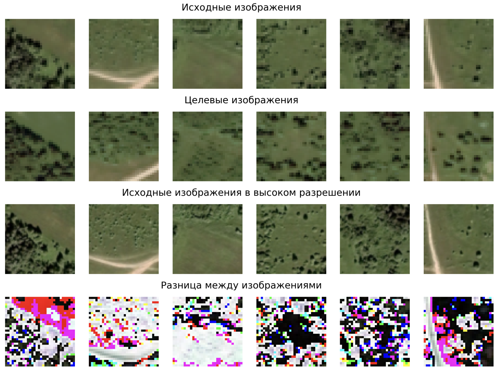
</div><br/>

Пример расшумления и полученная разница. Это инкремент к исходному изображению, поэтому средняя яркость пикселей в середине шкалы.

<br/><div align="center" >
  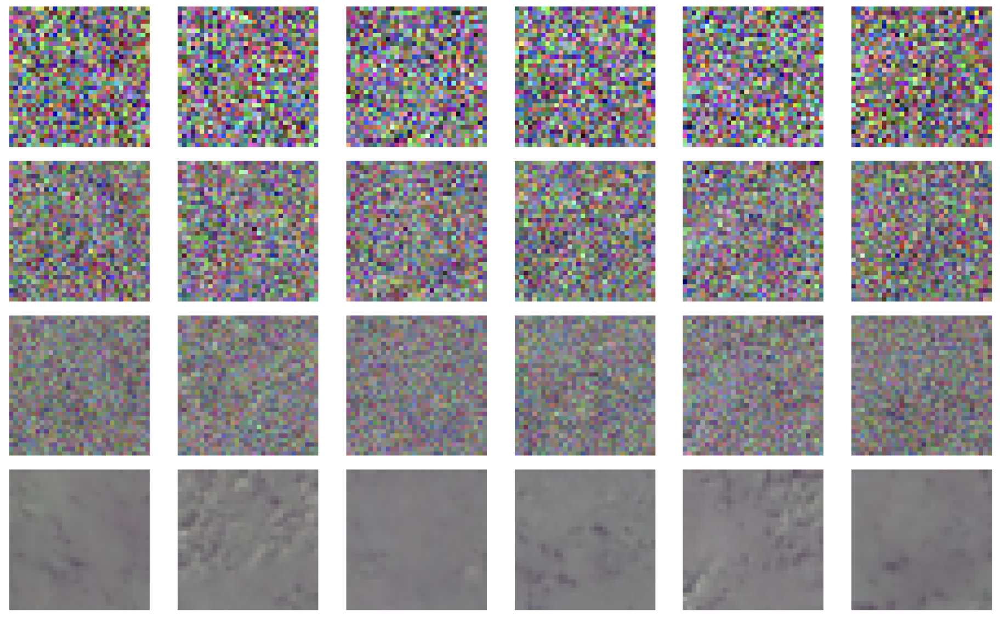
</div><br/>

### Архитектура модели

Используем решение из библиотеки diffusers а-ля conditioned unet, в качестве условия выступают нарезанные патчи из исходного изображения

<br/><div align="center" >
  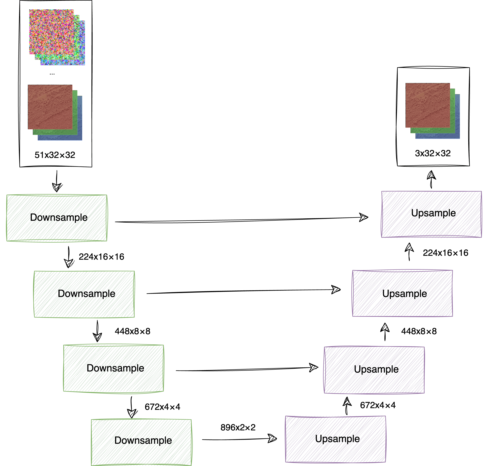
</div><br/>

- Downsample-блок: [diffusers на github](https://github.com/huggingface/diffusers/blob/main/src/diffusers/models/unets/unet_2d_blocks.py#L1027)
- Upsample-блок: [diffusers на github](https://github.com/huggingface/diffusers/blob/main/src/diffusers/models/unets/unet_2d_blocks.py#L2267)

 Полученное на выходе unet-модели изображение все еще небольшого размера 32 на 32. Увеличиваем его с помощью отдельной модели класса super resolution.

## Super Resolution модель

Учитывая специфику данных, готовые модели, предобученные на универсальных данных, не дают удовлетворительного результата. Поэтому обучим с нуля свою.

### Формат входных данных

Используем те же данные, что и для unet, генерируем пары размером 32 на 32 и 128 на 128.

<br/><div align="center" >
  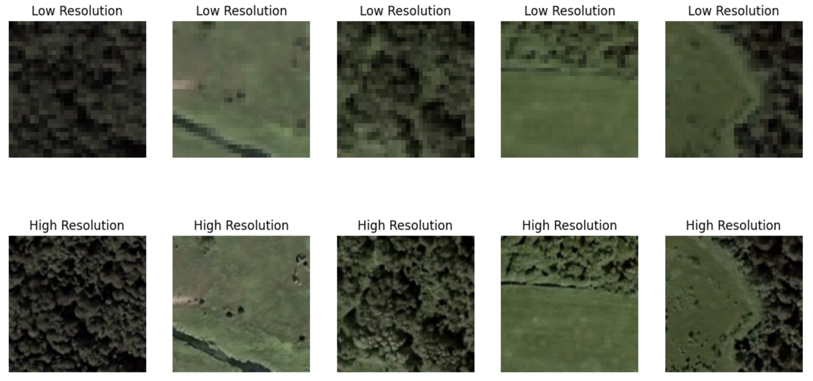
</div><br/>

### Архитектура модели

Каноническая из оригинальной статьи: [arxiv](https://arxiv.org/pdf/1809.00219).

<br/><div align="center" >
  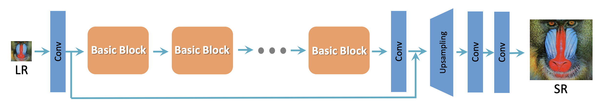
</div><br/>

Задачей являлся лишь выбор числа rrdb-блоков.

<br/><div align="center" >
  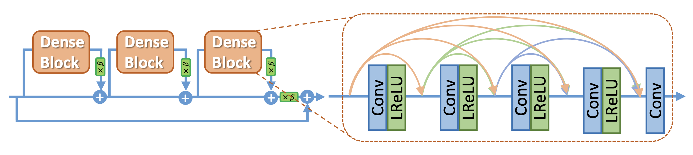
</div><br/>

В оригинальной статье исследуется вариант с 23 RRDB-блоками. В данной работе решено было остановиться на 16 блоках. 

Сравнительные кривые обучения для 1-, 4- и 16-блочной модели:

<br/><div align="center" >
  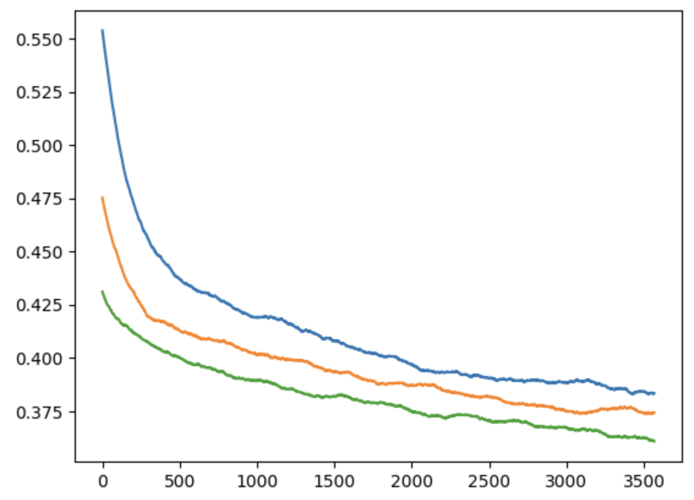
</div><br/>

Пример работы 16-блочной модели:

<br/><div align="center" >
  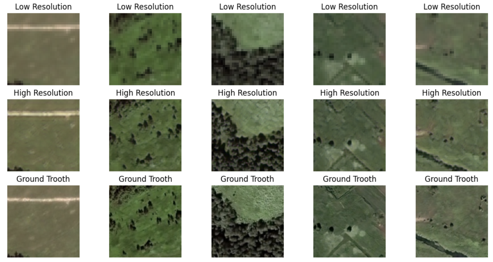
</div><br/>

## Результат работы

Пример результата последовательного применения unet-модели и esrgan-модели для исходного изображения 128 на 128:

<br/><div align="center" >
  
</div><br/>

Раземер изображения на выходе позволяет подавать его на вход снова и снова, тем самым "заглянув в будущее":

  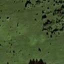  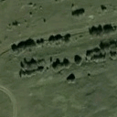 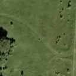

## Зависимость от площади

Интересно узнать начиная с какого размера площади поверхности Земли модель начинает находить "контекст", который позволяет хоть как-то предсказать как же изменится ландшафт. Для наглядности, вот примеры размеров входных изображений:

<br/><div align="center" >
  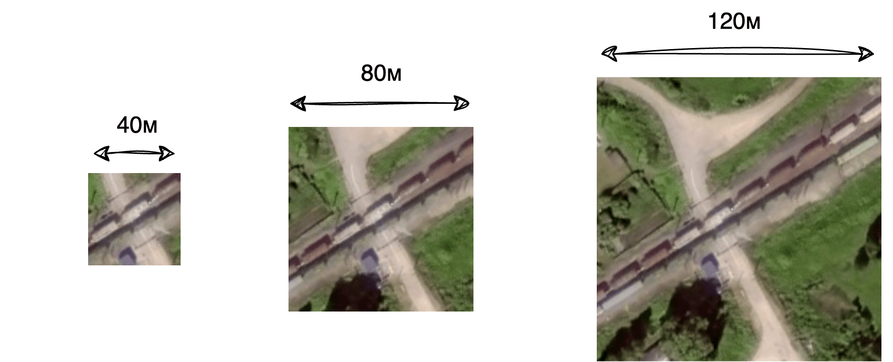
</div><br/>

Модель обучалась на одинаковых датасетах (и по размеру изображений и по их количеству), но на разном масштабе от 40м до 130м на изображение. Затем результат сравнивался с реальными снимками с помощью признаков предобученной сверточной vgg-модели [perceptual_loss.ipynb](https://github.com/prozoroff/cv-otus/blob/main/project/perceptual_loss.py). 

Логично, что чем больше площадь, тем для модели понятнее характер территории, она обучается быстрее и качетсвеннее. Кривые обучения для разных масштабов следующие:

<br/><div align="center" >
  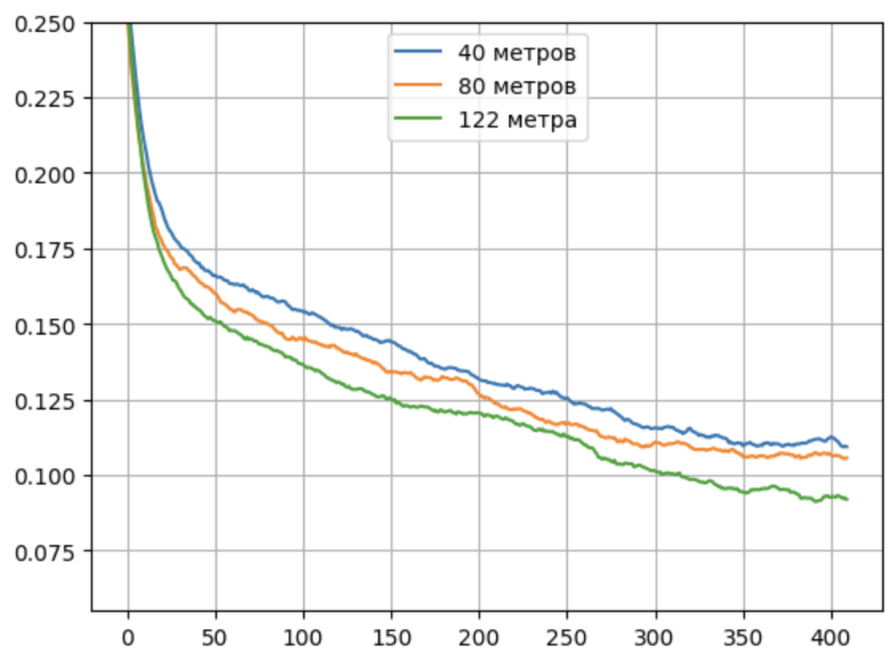
</div><br/>

А если взглянуть на зависимость perceptual loss метрики от масштаба изображений, то можно заметить, что качество стремительно растет при увеличении масштаба и достигает насыщения в районе 80-120м. Здесь сказывается то, что модель училась генерировать изображения очень низкого разрешения 32 на 32 пикселя, которые на большом масштабе просто теряют все важные детали (разрешение исходных спутниковых снимков 0.625 метра на пиксель).

<br/><div align="center" >
  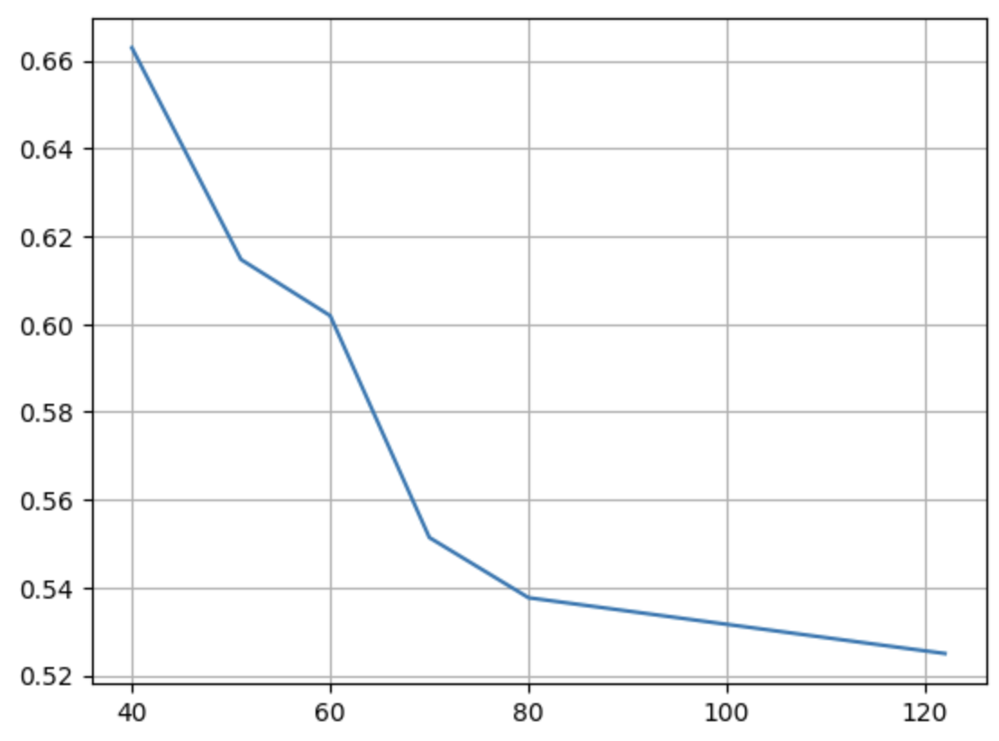
</div><br/>

## Итого

Что может улучшить результаты:

- большее разрешение unet-модели (например 128 на 128)
- как следствие больший масштаб изображений в датасете
- специализация архитектуры модели
- увеличение размера датасета


