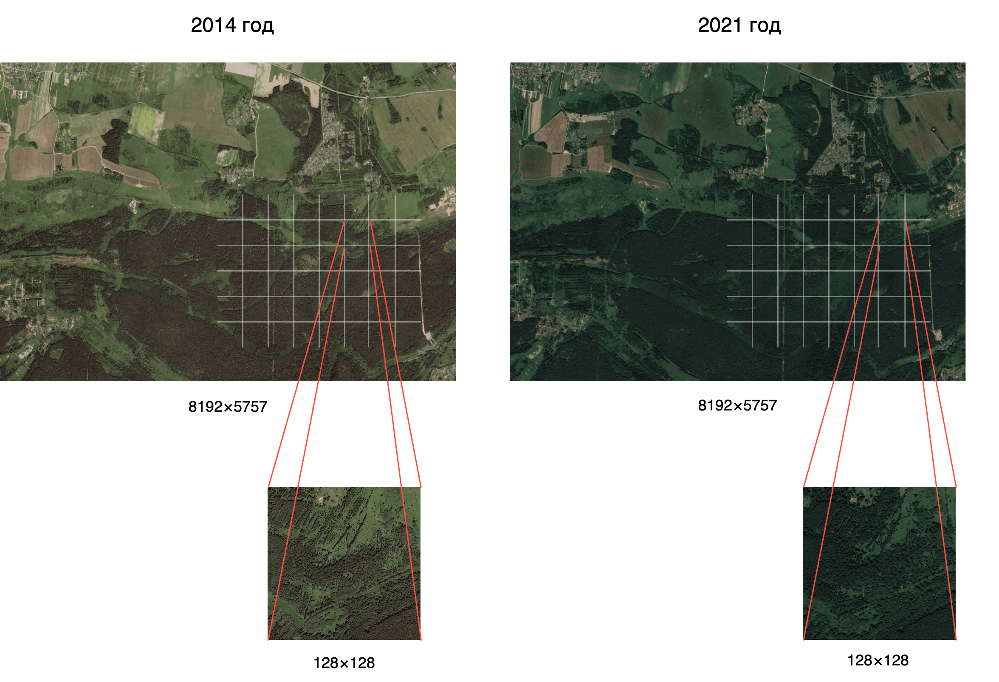
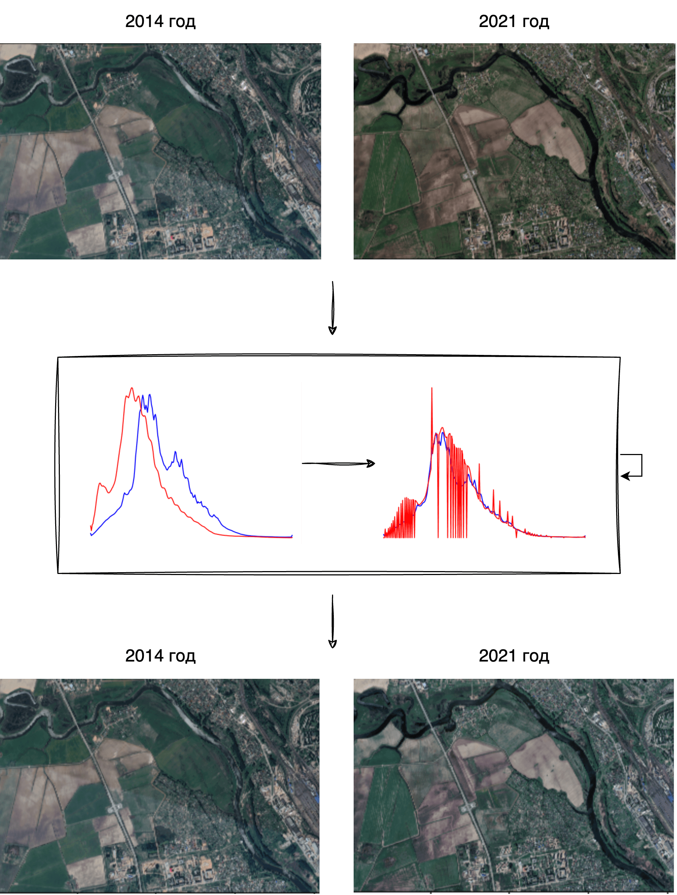
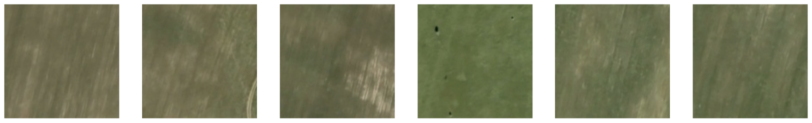
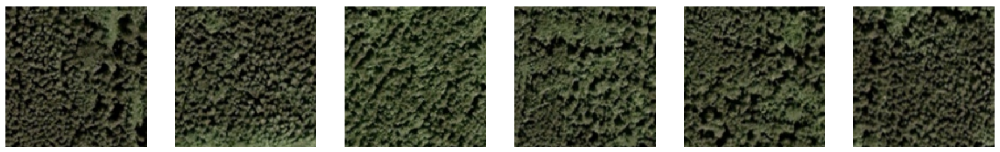
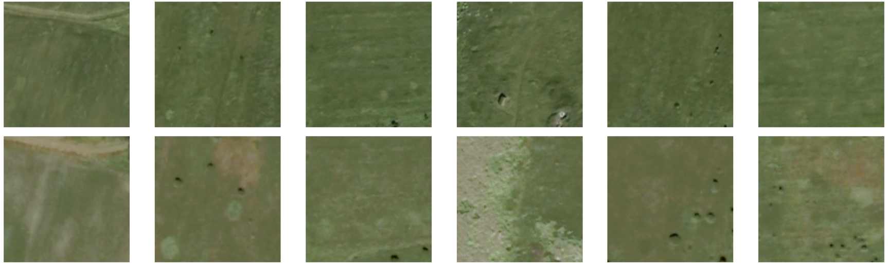
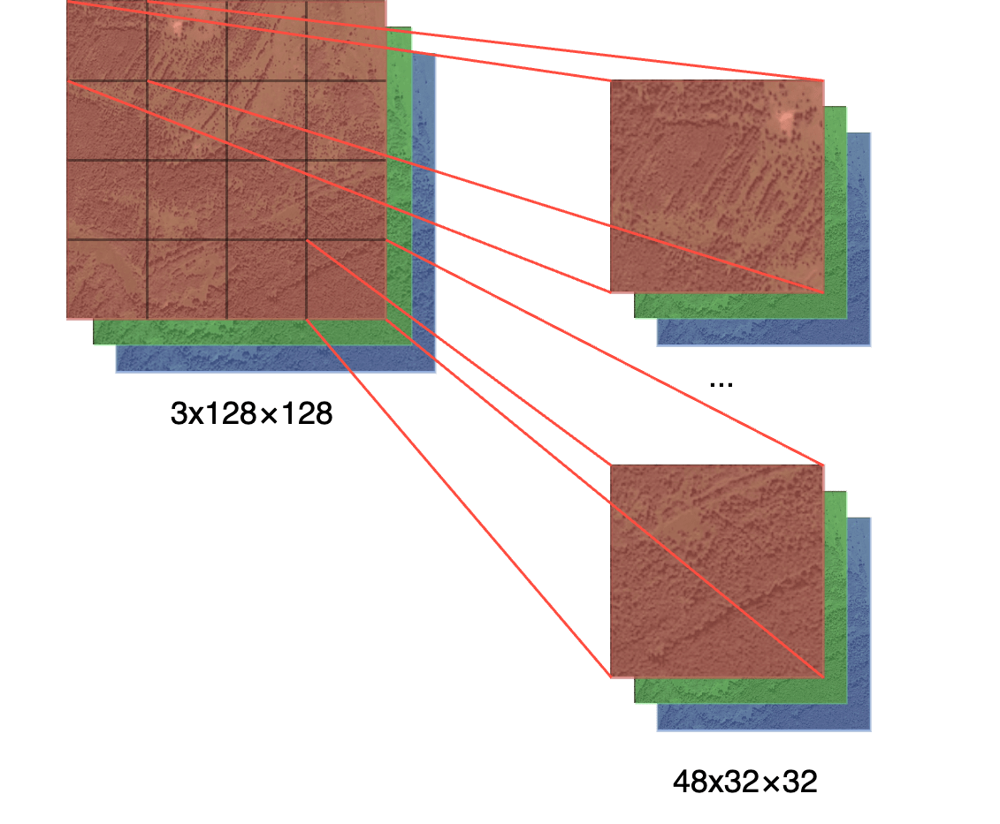

Здесь хранятся файлы проекта «Предсказание изменения ландшафта Земли по спутниковым снимкам на основе методов глубокого обучения»

- 🧲 [train_unet.ipynb](https://github.com/prozoroff/cv-otus/blob/main/project/train_unet.ipynb): блокнот с кодом обучения unet-модели генерации изменений ландшафта
- ⬆️ [train_srgan.ipynb](https://github.com/prozoroff/cv-otus/blob/main/project/train_srgan.ipynb): блокнот с кодом обучения srgan-модели повышения разрешения спутниковых снимков
- 📊 [match_histogram.ipynb](https://github.com/prozoroff/cv-otus/blob/main/project/match_histogram.ipynb)
: блокнот с кодом нормализации гистограмм спутниковых снимков за разные годы
- ⚡ [inference.ipynb](https://github.com/prozoroff/cv-otus/blob/main/project/inference.ipynb)
: блокнот с примером запуска обученной модели

## Некоторые работы в предметной области

- Предсказание изменения ландшафта по данным о плотности населения: [arxiv paper](https://arxiv.org/pdf/2101.05069)
- Генерация спутниковых снимков по классу местности: [github code](https://github.com/weihancug/GAN-based-HRRS-Sample-Generation-for-Image-Classification)
- Локализация подделок спутниковых снимков с помощью GAN: [arxiv paper](https://arxiv.org/pdf/1802.04881)
- Преобразования изображений Landsat 8 в Sentinel-2 с помощью GAN: [github code](https://github.com/Rohit18/Landsat8-Sentinel2-Fusion)
- Генерирование спутниковых снимков по данным сегментации с помощью SD: [github code](https://github.com/RubenGres/Seg2Sat)
- Эмбеддинги для спутниковых снимков: [github code](https://github.com/fisch92/Metric-embeddings-for-satellite-image-classification)
- Предсказание загрязнения воздуха по спутниковым снимкам: [github code](https://github.com/arnavbansal1/SatellitePollutionCNN)
- Super resolution для спутниковых снимков: [ieee paper](https://ieeexplore.ieee.org/document/9472869)
- Предсказание изменений в лесном покрытии: [github code](https://github.com/annusgit/ForestCoverChange)
- Детекция изменений между двумя спутниковыми снимками [ipol paper](https://www.ipol.im/pub/art/2022/439/article.pdf)

## Подготовка данных

- выгружаем их Google Earth попарные полноразмерные спутниковые снимки за 2007 и 2014 год
- выравниваем гистограммы полученных изображений
- нарезаем их на квадраты 128 на 128 (~5k изображений из одного полноразмерного)

<br/><div align="center" >
  
</div><br/>

### Выравнивание гистограмм

У снимков за разные годы могут быть:
- разные источники
- разные настройки
- разные погодные условия
В результате снимки, сделанные в один месяц могут выглядеть абсолютно по-разному. Самое малое, что можно сделать - выровнять кривые поканально, чтобы изображения имели близкие цвета, контраст и яркость.

```python
image2_equalized = np.zeros_like(image2)

for i in range(3):  # Проход по каждому каналу RGB
    hist1 = cv2.calcHist([image1], [i], None, [256], [0, 256])
    hist2 = cv2.calcHist([image2], [i], None, [256], [0, 256])

    cdf1 = hist1.cumsum()
    cdf1 = (cdf1 / cdf1[-1]) * 255

    cdf2 = hist2.cumsum()
    cdf2 = (cdf2 / cdf2[-1]) * 255

    lut = np.interp(cdf2, cdf1, range(256)).astype(np.uint8)
    image2_equalized[:,:,i] = cv2.LUT(image2[:,:,i], lut)
```

<br/><div align="center" >
  
</div><br/>

### Фильтрация нерелевантных пар

Далее необходимо отфильтровать пары изображений, которые:
- имеют слишком мало деталей
- имеют слишком много деталей
- отличаются слишком сильно

Для поиска первых двух проблем используем пороговые значения для суммы краев полученных с помощью детектора Кэнни.

```python
factor = 1 / (PATSH_SIZE * PATSH_SIZE)
canny_sum = kornia.filters.canny(img.unsqueeze(0).float(), kernel_size=CANNY_KERNEL_SIZE)[0].sum() * factor
```

Примеры изображений со слишком малым и слишком большим количеством деталей:

<br/><div align="center" >
  
  
</div><br/>

Для третьего пункта посчитаем количество пикселей на изображениях, отличающихся больше определенной величины и, опять же, отсечем по порогу.

```python
factor = 1 / (CHANNELS * PATSH_SIZE * PATSH_SIZE)
diff_sum = (torch.abs(img_1 - img_2) > DIFF_THRESHOLD).sum().item() * factor
```

Примеры изображений с количеством отличий выше заданного порога:

<br/><div align="center" >
  
</div><br/>

## UNet-модель

### Входные данные

Нарезаем трехканальное изображение 128 на 128 на патчи размером 32 на 32. Получаем входное состояние размером 48x32x32:

<br/><div align="center" >
  
</div><br/>
